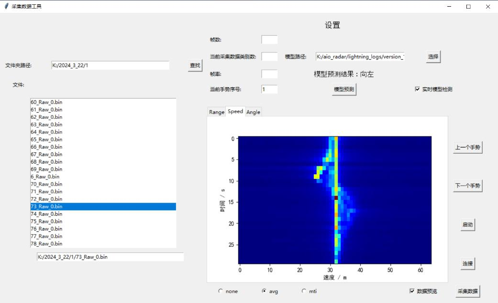
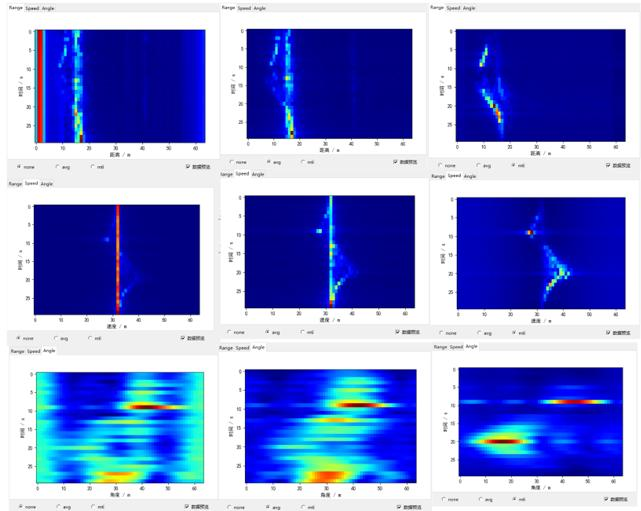
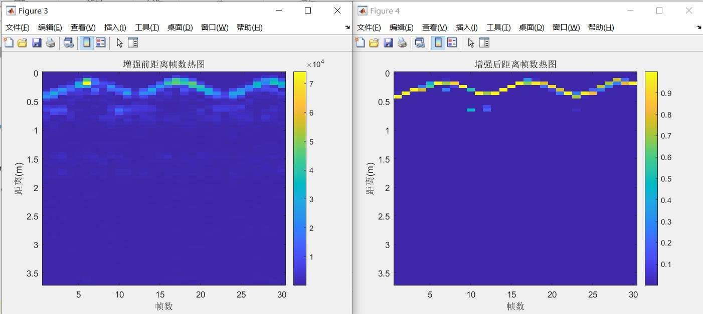
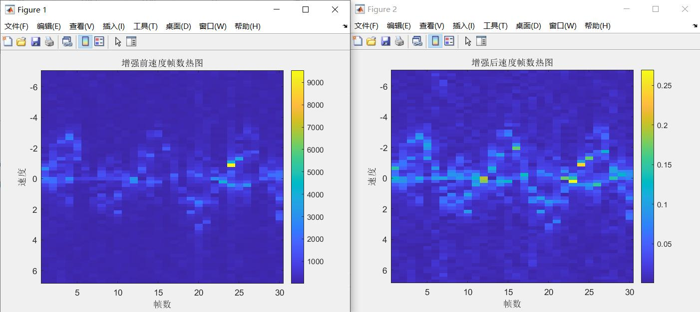
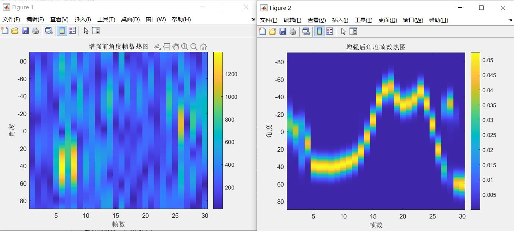
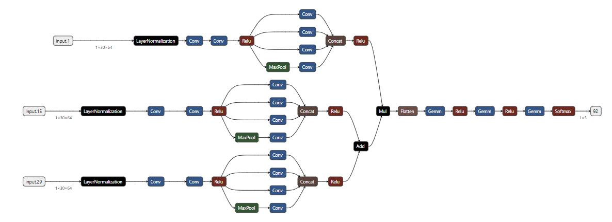
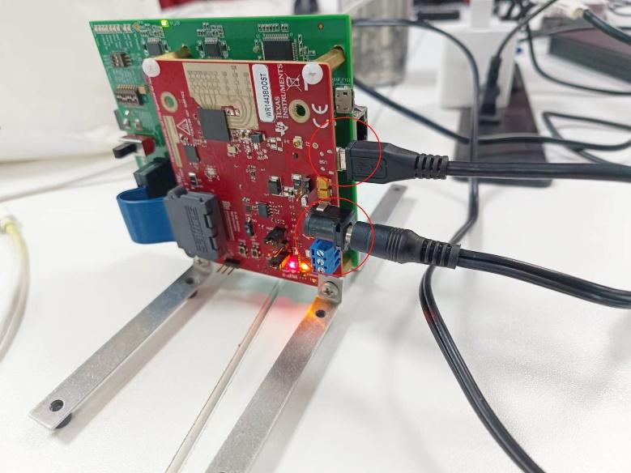

# 项目说明

这是一个使用毫米波雷达进行手势识别的项目, 项目使用的雷达是TI公司的IWR1443BOOST，该项目包含了雷达数据的采集、处理、特征提取、训练的整个流程。模型结构使用自己设计的SeparableView network，该网络结构是一个轻量级的网络，适合在嵌入式设备上运行。

## 功能展示

### 采集界面

这个采集界面有初始化和连接雷达传感器,可以选择保存的路径, 采集一次数据后会进行特征提取可视化,并可以使用之前训练好的模型进行预测, 这一步是为了方便用户在采集数据的同时可以看到数据的特征, 以及模型的预测结果, 从而可以更好的调整雷达的位置和姿态, 以及数据的采集方式。需要注意的是, 数据处理会有一定的延迟, 大约采集1s的手势数据, 处理时间大约在0.5s左右.



### 特征提取

主要对毫米波雷达的原始数据进行了距离维、速度维、角度维的特征提取, 并对特征进行了可视化, 以便更好的理解数据的特征。具体细节可以参考项目根目录下的毫米波雷达手势识别.pdf



### 数据增强







### 模型结构图

这个网络结合了 Inception 块和深度可分离块，能够更好地提取出不同尺度的特征，从而提高手势识别的精度。与传统的全连接层相比，这种结构在保证精度的条件下，能够降低模型的计算量，从而减少硬件资源消耗。



## 目录结构

```shell

├── AAnet.py            # 网络模型
├── lightning_logs      # (自动生成)训练日志
├── out                 # (自动生成)输出文件
├── RealTimeCollect     # 实时雷达数据采集和处理
├── Script              # 用于配置雷达的脚本
├── DataProcess         # 数据处理
    ├── data_analysis.py        # 数据分析
    ├── feature_extraction.py   # 特征提取
    └── train.py                # 训练
├── ui.py               # 采集界面
|── 开发文档.md          # 开发文档
├── README.md           # 说明文档
└── requirements.txt    # 依赖
```

## 环境配置

### 硬件需求

- IWR1443BOOST
- DCA1000EVM

硬件按照如下连接：



### 软件环境搭建

#### 软件安装

- [mmWave SDK](https://www.ti.com/tool/MMWAVE-SDK)
- [mmWaveStudio](https://www.ti.com/tool/MMWAVE-STUDIO)
- [vscode](https://code.visualstudio.com/)
- [matlab](https://www.mathworks.com/products/matlab.html)

#### python环境搭建

安装依赖(需要python3.9及以上版本,创建虚拟环境就不写了)

```shell
pip install -r requirements.txt
```

## 如何使用

### 采集数据

激活虚拟环境并运行ui.py, 初始化后就可以开始采集数据了

```shell
conda activate your_env
python ui.py
```

### 数据后处理

具体参考DataProcess文件夹下的文件说明

### 模型部署及实时推理

具体参考另一个我的项目[RealTimeGestureRecognition](https://github.com/duzitao1/radar_cpp)
> 主要功能已经实现, 还没写好README.md
